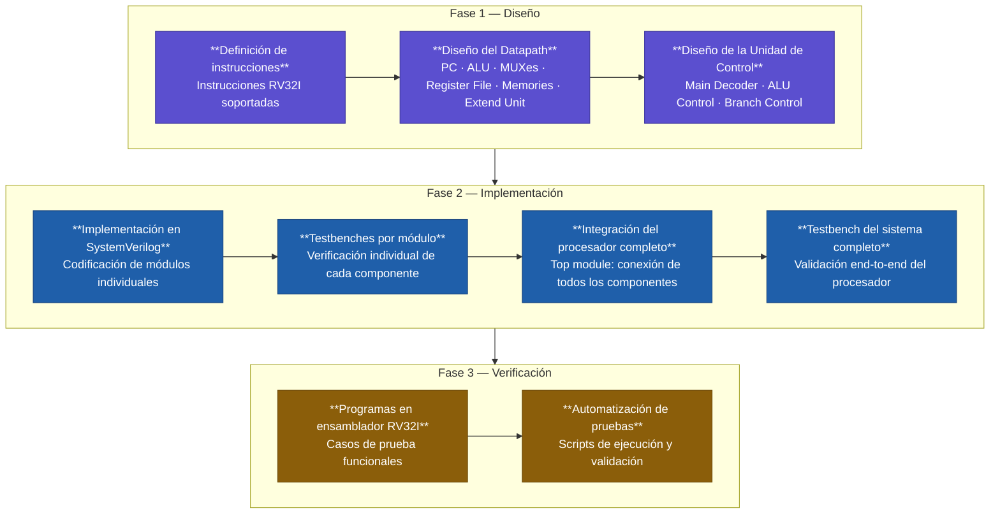

# Procesador RISC-V Uniciclo RV32I en SystemVerilog

## Descripción General

Este proyecto consiste en la implementación de un procesador uniciclo basado en la arquitectura RISC-V RV32I utilizando SystemVerilog.

El diseño fue desarrollado como parte del curso de Diseño de Sistemas Digitales y tiene como objetivo aplicar conceptos relacionados con datapath, controlpath, memoria, ALU y ejecución de instrucciones en una microarquitectura uniciclo.

## Instrucciones Soportadas

| Categoría | Instrucciones |
|------------|----------------|
| **Load Instructions** | `lw`, `lh`, `lb`, `lhu`, `lbu` |
| **Store Instructions** | `sw`, `sh`, `sb` |
| **Arithmetic and Logic** | `add`, `addi`, `sub`, `xor`, `xori`, `or`, `ori`, `and`, `andi` |
| **Shift Operations** | `sll`, `slli`, `srl`, `srli`, `sra`, `srai` |
| **Branch Instructions** | `beq`, `bne`, `blt`, `bge` |
| **Comparison Instructions** | `slt`, `slti`, `sltu`, `sltiu` |
| **Jump and Upper Immediate** | `lui`, `jal`, `jalr` |

Además, cada módulo funcional cuenta con su respectivo testbench para validar su funcionamiento individual, así como un testbench completo para verificar el comportamiento integral del procesador.

## Metodología de Desarrollo

## Datapath del Procesador

## Módulos

### ALU Control

La unidad ALU Control se encarga de determinar qué operación debe ejecutar la ALU a partir de los campos de la instrucción y de la señal `ALUOp` generada por la unidad de control principal.

Debido a que múltiples instrucciones comparten el mismo formato pero realizan operaciones diferentes, es necesario decodificar ciertos campos específicos de la instrucción, principalmente:

- `funct3`
- `funct7`
- `op[5]`
- `ALUOp`

Con esta información, la unidad genera una señal `ALUControl` que selecciona la operación exacta que debe realizar la ALU, por ejemplo:

- suma
- resta
- AND
- OR
- XOR
- desplazamientos
- comparaciones

La siguiente tabla resume el mapeo entre los campos de las instrucciones RV32I y las señales de control utilizadas por la ALU.

# ALU Control Table - RISC-V Single Cycle

| ALUOp | funct3 | {op5, funct7} | ALUControl | Instruction |
|------|--------|----------------|------------|-------------|
| 00 | x | x | 000 | lw, sw |
| 01 | x | x | 001 | beq |

## R-Type / I-Type Operations

| ALUOp | funct3 | {op5, funct7} | ALUControl | Instruction |
|------|--------|----------------|------------|-------------|
| 10 | 000 | 00, 01, 10 | 000 | add |
| 10 | 000 | 11 | 001 | sub |
| 10 | 111 | x | 010 | and |
| 10 | 110 | x | 011 | or |
| 10 | 100 | x | 1000 | xor |
| 10 | 001 | 00 | 100 | sll |
| 10 | 010 | x | 101 | slt / slti |
| 10 | 011 | x | 1001 | sltu / sltiu |
| 10 | 101 | 00 | 110 | srl |
| 10 | 101 | 01 | 111 | sra |

## Branch Operations

| ALUOp | funct3 | {op5, funct7} | ALUControl | Instruction |
|------|--------|----------------|------------|-------------|
| 01 | 000 | x | 001 | beq |
| 01 | 001 | x | 001 | bne |
| 01 | 100 | x | 101 | blt |
| 01 | 101 | x | 101 | bge |

### Extend Unit (Immediate Generator)

La unidad Extend tiene como propósito generar los valores inmediatos utilizados por las instrucciones de tipo I, S, B, U y J de la arquitectura RISC-V.

En RV32I, los inmediatos no poseen un formato único. Dependiendo del tipo de instrucción, los bits inmediatos se encuentran distribuidos en diferentes posiciones dentro de la instrucción de 32 bits.

Por esta razón, la unidad Extend debe reorganizar y extender correctamente los bits correspondientes para producir un inmediato de 32 bits con signo o sin signo, según corresponda.

La señal `ImmSrc`, generada por la unidad de control principal, indica qué formato de inmediato debe construirse.

La siguiente tabla muestra cómo se forma el inmediato para cada tipo de instrucción soportada.
# Tabla del Extend

| ImmSrc | ImmExt | Type | Description |
|--------|--------|------|-------------|
| 000 | {{20{Instr[31]}}, Instr[31:20]} | I | 12-bit signed immediate |
| 001 | {{20{Instr[31]}}, Instr[31:25], Instr[11:7]} | S | 12-bit signed immediate |
| 010 | {{20{Instr[31]}}, Instr[7], Instr[30:25], Instr[11:8], 1'b0} | B | 13-bit signed immediate |
| 011 | {{12{Instr[31]}}, Instr[19:12], Instr[20], Instr[30:21], 1'b0} | J | 21-bit signed immediate |
| 100 | {Instr[31:12], 12'b0} | U | 20-bit upper immediate |
